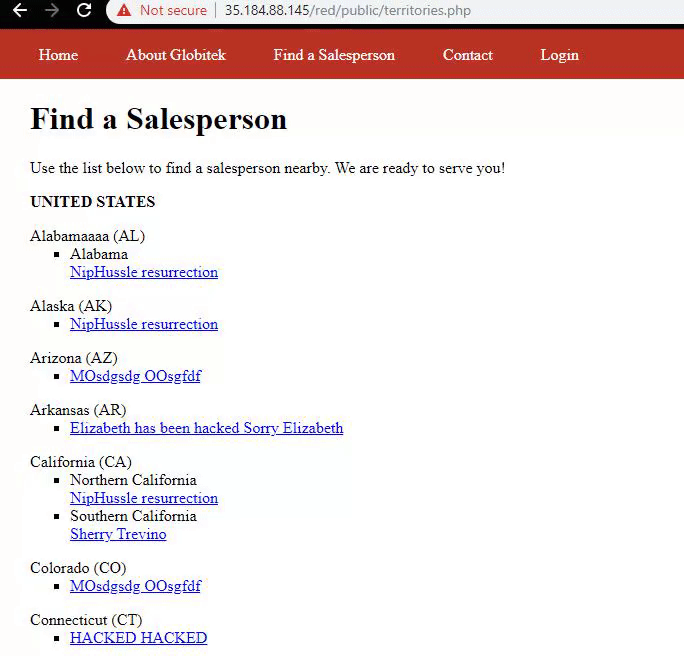

Week 9 Project: Pentesting Live Targets

Time Spent: 10 Hours spent in total

1. Username Enumeration:
2. Insecure Direct Object Reference 

3. SQL Injection
4. Cross-Site Scripting 
5. Cross-Site Request Forgery 
6. Session Hijacking/Fixation 