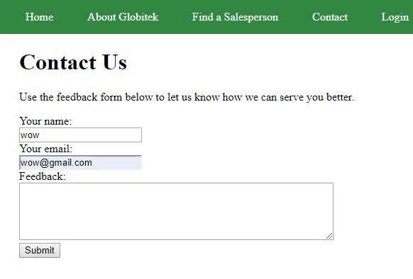
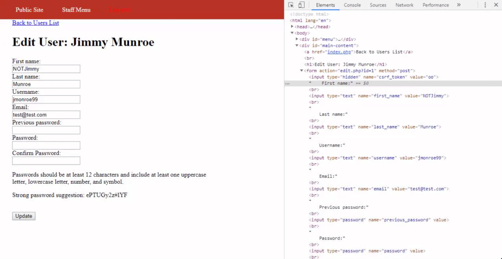

Week 9 Project: Pentesting Live Targets

Time Spent: 10 Hours spent in total

<pre>1. Username Enumeration
</pre>

<pre>2. Insecure Direct Object Reference 
RED</pre>

In Find a Saleperson, click on an existing salesperson and in the url set the id attribute to 10, 11, etc. 

<pre>3. SQL Injection
BLUE</pre>

Using SQL injection in blue by trying ' OR 1=1-- we recieve the message "Database query failed." showing that the database changed.

<pre>4. Cross-Site Scripting 
Green</pre>

Using Cross site scripting on the green site by typing  in the feedback and then logging in and click on feedback we can see the pop-up notifications of all the previous feedbacks.

<pre>5. Cross-Site Request Forgery 
RED</pre>

Here we are changing the user's information without the being an admin 

<pre>6. Session Hijacking/Fixation 
BLUE</pre>

Here we are using public/hacktools/change_session_id.php to get the user's session id on the blue site. Then the attacker copies that session id onto their site to gain access to the user's account.
